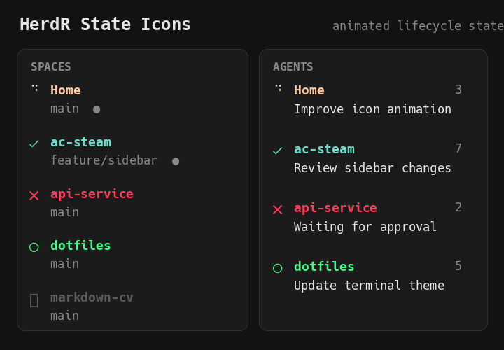

# HerdR State Icons

Animated, colorable lifecycle icons for HerdR's **Spaces** and **Agents** sidebar views.



The plugin reports one state-specific sidebar token per agent and Space. HerdR's normal sidebar configuration controls each token's color and style.

## Features

- Animated Braille spinner while an agent is working
- Separate icons and colors for working, done, blocked, idle, and unknown states
- State icons in both Spaces and Agents views
- Brief done state after work completes
- Invisible placeholder for unknown Spaces, preserving label alignment
- Configurable glyphs, animation frames, speed, and done-state duration
- Single animator process, protected against concurrent event races
- No third-party Python packages

## Requirements

- [HerdR](https://github.com/herdrdev/herdr) 0.8.2 or newer
- Python 3.11 or newer (`python3` on `PATH`)
- macOS or Linux
- A [Nerd Font](https://www.nerdfonts.com/) for the default static icons

The working spinner uses standard Unicode Braille characters. Replace the static icons in the plugin configuration if you do not use a Nerd Font.

## Install

```bash
herdr plugin install flowreaction/herdr-state-icons
```

HerdR installs and enables the plugin globally. Confirm it is registered:

```bash
herdr plugin list --plugin flowreaction.state-icons
herdr plugin action list --plugin flowreaction.state-icons
```

## Configure the sidebar

The plugin publishes custom tokens; add them to your HerdR config for them to appear. The example below gives each state a distinct color.

```toml
[ui.sidebar.spaces]
rows = [
  [
    { token = "$space_working_line", fg = "#ffc799", bold = true, dim = false },
    { token = "$space_done_line", fg = "#66ddcc", bold = true, dim = false },
    { token = "$space_blocked_line", fg = "#ff3b5c", bold = true, dim = false },
    { token = "$space_idle_line", fg = "#39ff88", bold = true, dim = false },
    { token = "$space_unknown_line", fg = "#5c5c5c", bold = true, dim = false },
  ],
  ["branch", "git_status"],
]

[ui.sidebar.agents]
rows = [
  [
    { token = "$state_working_line", fg = "#ffc799", bold = true, dim = false },
    { token = "$state_done_line", fg = "#66ddcc", bold = true, dim = false },
    { token = "$state_blocked_line", fg = "#ff3b5c", bold = true, dim = false },
    { token = "$state_idle_line", fg = "#39ff88", bold = true, dim = false },
    { token = "$state_unknown_line", fg = "#5c5c5c", bold = true, dim = false },
    "tab",
  ],
  ["agent"],
]
```

Only the token matching the current state contains a value, so placing all five state tokens in one row produces one icon and label—not five columns.

Validate and reload your configuration:

```bash
herdr config check
herdr config reload
```

## State mapping

| State | Default | Meaning |
| --- | --- | --- |
| Working | Braille animation | Agent is actively processing |
| Done | `󰄬` | Work completed recently |
| Blocked | `󰅖` | Agent needs approval or input |
| Idle | `󰝦` | Agent is ready or its result was viewed |
| Unknown | `󰋗` | HerdR cannot confidently classify the agent |

Unknown Spaces use an invisible one-cell placeholder instead of the question-mark icon, keeping Space labels aligned.

## Configure icons and timing

The defaults work without a plugin configuration file. To customize them, find the plugin's configuration directory:

```bash
herdr plugin config-dir flowreaction.state-icons
```

Create `config.toml` in that directory. See [`config.example.toml`](config.example.toml) for a complete example:

```toml
[icons]
working = ["⠙", "⠸", "⢰", "⣠", "⣄", "⡆", "⠇", "⠋"]
done = "󰄬"
blocked = "󰅖"
idle = "󰝦"
unknown = "󰋗"
needs-input = "󰋗"

[animation]
frame-seconds = 0.15
done-hold-seconds = 6.0
```

Apply plugin configuration changes:

```bash
herdr plugin action invoke flowreaction.state-icons.refresh
```

## Actions

| Action | Purpose |
| --- | --- |
| `flowreaction.state-icons.refresh` | Start or refresh state reporting |
| `flowreaction.state-icons.stop` | Stop the animator and clear all plugin tokens |

HerdR also starts the plugin when its server starts and refreshes it when agent detection or state changes occur.

## Update

HerdR v1 has no separate plugin update command. Reinstall to update a GitHub-managed plugin:

```bash
herdr plugin install flowreaction/herdr-state-icons
```

## Uninstall

```bash
herdr plugin uninstall flowreaction.state-icons
```

Remove the custom `$state_*_line` and `$space_*_line` entries from your HerdR sidebar configuration if you no longer need them.

## Development

Clone the repository, then link the working tree:

```bash
git clone https://github.com/flowreaction/herdr-state-icons.git
herdr plugin link "$PWD/herdr-state-icons" --enabled
```

Run tests with the Python standard library:

```bash
python3 -m unittest discover -s tests -v
```

The plugin uses `HERDR_BIN_PATH` for portable communication with the active HerdR server and stores its PID, lock, and stop files under `HERDR_PLUGIN_STATE_DIR`.

## License

[MIT](LICENSE)
